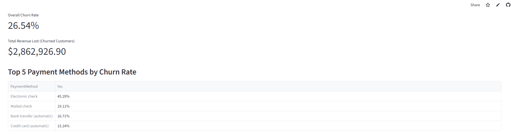
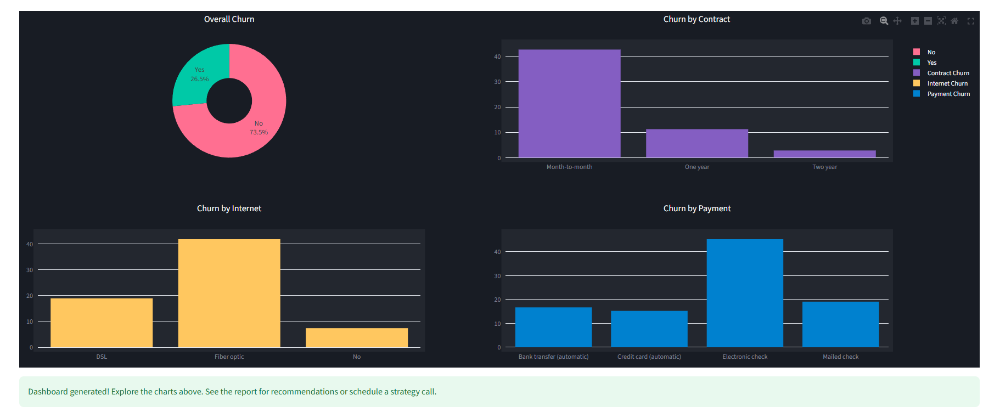

# Here is an example of a Python/Streamlit Churn Dashboard. Upload your data and try it yourself !

## https://customer-churn-dashboard-tylerv.streamlit.app/

You can use the example file in this repo to test it 

